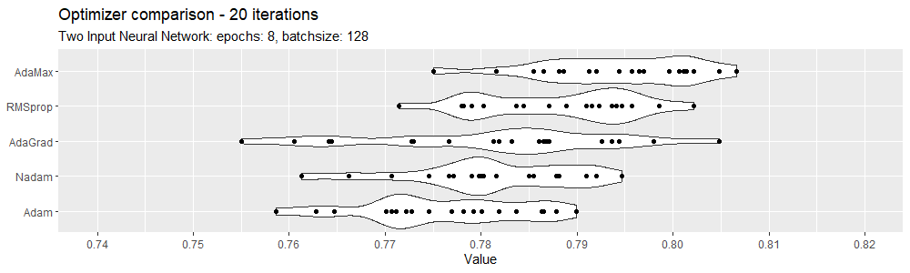

# Introduction
Deadline: 18/11 - 2019

The site [https://faketrump.ai/](https://faketrump.ai/) is an interesting example of AI-powered fake-text generation. They write:

>We built an artificial intelligence model by fine-tuning [GPT-2](https://openai.com/blog/better-language-models/) to generate tweets in the style of Donald Trump’s Twitter account. After seeing the results, we also built a discriminator that can accurately detect fake tweets 77% of the time — think you can beat our classifier? Try it yourself!

GPT-2 is a neural transformer-based model, that has been announced by OpenAI in February 2019 and created considerable discussion because they decided - in contrast to their earlier policies - not to release the mode to the public. Their central argument was that the model could be used to produce fake news, spam and alike too easily. The footnote of the faketrump page reads: “Generating realistic fake text has become much more accessible. We hope to highlight the current state of text generation to demonstrate how difficult it is to discern fiction from reality.”

Since then several organizations and researchers have shown that it is [possible to develop systems to detect “fake text”](https://www.theguardian.com/technology/2019/jul/04/ai-fake-text-gpt-2-concerns-false-information). We believe that you too can implement a competitive system.

This assignment is not about Natural Language Processing (NLP) but about being able to deal with sequential data using deep learning. Some basic knowledge from M2 can be useful to squeeze the last 1% performance but you should be able to get great results with pure Keras. The data can be found [here](https://github.com/DeepLearnI/trump_tweet_classifier/raw/master/code/tweet_labels.csv) and has the following format:


There are 8000 real Trump tweet sand 7348 fake ones.

Having been with us for M2, you may ask: How do I go from text to numerical values that I can use in a neural model?
You can for instance just use the “Tokenizer” that’s part of Keras. 

vocabulary_size = 5000
tokenizer = Tokenizer(num_words= vocabulary_size)
tokenizer.fit_on_texts(df['text'])
sequences = tokenizer.texts_to_sequences(df['text'])

This will turn the tweets into sequences of indices. From here, you just need to “pad” the sequences (for en easier workflow). Here, the tweets were padded to a length of 100 with pre-padding (leading 0s are attached to reach the same length for all tweets). But what kind of network do you expect me to build? That’s up to you. Just make sure it is more advanced than a basic feed-forward-net. Not acceptable solution: You use SpaCy or similar to get average vectors for the tweets and then build an M1 style classifier just using a neural model rather than a random forest or similar.

If you want to build such a simple model as a baseline - that’s fine, but we do expect that you come up with something more advanced.

*   You can use CNNs, RNNs (GRU, LSTM, BiLSTMS), Embedding layers in combinations that you think are useful (explain your choices). 
*   If you want, you are welcome to use pre-trained word-vectors (public domain or homemade). 
*   You can go even deeper and explore transformer-based models, attention and the more recent 2018-19 stuff. 
*   BUT: A top-performance can be achieved just using Keras and no fancy NLP stuff. Be creative and use the 100s of tutorials and recipes on the web.


# Assignment

In this first section i load data and generate two new variables, id which is an index i need for the elastic net regression, and char that is the number of characters in each of the tweets..

It's important to notice that with the creation of the id column before the split there is a danger of contamination as from what i can see the tweets are ordered in the original data, true first, then fake.. this means that giving any algorithm this id variable would drastically improve the accuracy, but it would be cheating. I'm aware in my use of this id variable, and since it's only used in the elastic net regression, which isn't the best performing, i'm confident that there isn't a problem.

```{r include=FALSE}
library(tidyverse)
library(keras)
library(caret)
library(tidytext)
library(rsample)
library(glmnet)
library(yardstick)
library(gridExtra)
library(tensorflow)

fake <- read_csv("https://github.com/DeepLearnI/trump_tweet_classifier/raw/master/code/tweet_labels.csv")
fake$id <- c(1:nrow(fake))
fake$char <- apply(fake[,1], MARGIN=1, FUN=nchar)

options(keras.view_metrics = FALSE)
```


## How spot fake?
First how do we seperate tweets from fake trump and tweets from the real trump? maybe the neural net can find some patterns that are too abstract for humans, but there are some pretty obvious ones, first the length of the tweet:

```{r fig.height=4, fig.width=10, message=FALSE, warning=FALSE}
p1 <- fake %>% ggplot(aes(labels)) + geom_bar(width=0.8) + labs(title="Count of labels")
p2 <- fake %>% ggplot(aes(char)) + 
  geom_histogram(fill="black", alpha=0.7, bins=100) +
  scale_x_continuous(limits = c(0,500)) +
  facet_wrap(~labels)+ labs(title="Count of characters in each tweet")

grid.arrange(p1,p2, layout_matrix=rbind(c(1,2,2,2,2)))
```

We can see that since twitter is limited to 280 characters trump often lands right on that amount. It also seems there are alot of tweets around half of that 140 characters, i'm not sure why this is, but that pattern isn't in the fake Trump tweets. 

Next we can look at what words affect the classification in a simple elastic net regression with all data, that is no train/test split:

```{r fig.height=4, fig.width=10, message=FALSE, warning=FALSE}
tidy_fake <- fake %>%
  unnest_tokens(word, tweet) %>%
  group_by(word) %>%
  filter(n() > 10) %>%
  ungroup()  %>% 
  anti_join(stop_words, by = "word")

sparse_words <- tidy_fake %>%
  count(id, word) %>%
  cast_sparse(id, word, n)

word_rownames <- as.integer(rownames(sparse_words))

joined <- data_frame(id = word_rownames) %>%
  left_join(fake %>% select(id, labels))

model <- cv.glmnet(sparse_words, joined$labels, family = "binomial", keep = T)

model$glmnet.fit %>%
  tidy() %>%
  filter(lambda == model$lambda.1se) %>%
  group_by(estimate > 0) %>%
  top_n(20, abs(estimate)) %>% 
  mutate(lab = ifelse(estimate > 0, "Top coeffecients", "Bottom Coeffecients")) %>% 
  ggplot(aes(reorder(term, estimate), estimate)) +
    geom_col(alpha = 0.7, show.legend = FALSE, width = 0.8, fill="black") +
    coord_flip() +
    geom_hline(aes(yintercept = 0)) +
    scale_x_reordered() +
    scale_fill_brewer(palette = "Paired") +
    labs(title = "Words affecting wether the model characterizes the tweet as true (Elastic Net)", 
         subtitle="Only words that appear more than 10 times", x=NULL, y=NULL) +
    scale_y_continuous(limits = c(-4,4), breaks = seq(-4, 4, by = 1)) + 
    facet_wrap(~lab, scales="free")
```

Again here we see a pattern. It seems that faketrump isn't found of using links in his tweets, this clearly something that will help classification tremendously.


## Setting up baseline

To test different techiqus i create a huge for loop, what happens in every iteration in this loop is:

- split data into train 0.75 and test 0.25 (changes for every iteration)
- calculate a random assignment model by probarbility of label in training set
- calculate a Elastic net regression with crossvalidated $\alpha$ and $\lambda$
- calculate 9 different neural networks
  - Simple feed forward neural network
  - Convolutional 1d neural network
  - LSTM neural network
  - Bidirectional LSTM neural network
  - GRU neural network
  - Recurrent neural network
  - Jess's neural network
  - Combination of different neural networks
  - Two input neural network (takes number of characters after LSTM)
- all models are evaluated against the test data, and each result is saved into a vector
- repeat


## Performance comparison


```{r include=FALSE, eval=F}
a <- Sys.time()
ran_acc <- NA
ela_acc <- NA
cha_acc <- NA
lst_acc <- NA
bid_acc <- NA
sim_acc <- NA
cnn_acc <- NA
jes_acc <- NA
gru_acc <- NA
com_acc <- NA
rnn_acc <- NA

for (i in 1:40) {
set.seed(i)
Index <- createDataPartition(fake$labels, p = 0.75, list = FALSE, times = 1)

faketrain  <- fake[ Index,]
faketest   <- fake[-Index,]

tokenizer <- text_tokenizer(num_words = 10000)
tokenizer %>% fit_text_tokenizer(faketrain$tweet)

x_train <- texts_to_sequences(tokenizer, faketrain$tweet) %>% 
  pad_sequences(maxlen = 100) 
x_test <- texts_to_sequences(tokenizer, faketest$tweet) %>% 
  pad_sequences(maxlen = 100) 

y_test   <- faketest %>% select(labels) %>% as.matrix()
y_train  <- faketrain %>% select(labels) %>% as.matrix()

ncharr     <- to_categorical(fake$char)
chartrain  <- ncharr[ Index,]
chartest   <- ncharr[-Index,]

#########################################################

pred <- rbinom(n=nrow(faketest), size=1, prob=mean(faketrain$labels)) %>% as.logical()

t <- table(pred, faketest$labels)
ran_acc[i] <- accuracy(t)[[3]]

#########################################################

tidy_fake <- faketrain %>%
  unnest_tokens(word, tweet) %>%
  group_by(word) %>%
  filter(n() > 10) %>%
  ungroup()  %>% 
  anti_join(stop_words, by = "word")

temp <- fake %>% select(id, char) %>% mutate(word = "nchar") %>% rename(n = char)

sparse_words <- tidy_fake %>%
  count(id, word) %>%
  rbind(temp) %>% 
  cast_sparse(id, word, n)

word_rownames <- as.integer(rownames(sparse_words))

joined <- data_frame(id = word_rownames) %>%
  left_join(fake %>% select(id, labels))

model <- cv.glmnet(sparse_words, joined$labels, family = "binomial", keep = T)

coefs <- model$glmnet.fit %>%
  tidy() %>%
  filter(lambda == model$lambda.1se)

intercept <- coefs %>%
  filter(term == "(Intercept)") %>%
  pull(estimate)

classifications <- faketest %>%
  unnest_tokens(word, tweet) %>%
  group_by(word) %>%
  filter(n() > 10) %>%
  ungroup()  %>% 
  anti_join(stop_words, by = "word") %>%
  inner_join(coefs, by = c("word" = "term")) %>%
  group_by(id) %>%
  summarize(score = sum(estimate),
            labels = first(labels))

result <- table(classifications$labels, classifications$score>0)
ela_acc[i] <- accuracy(result)[[3]]


#########################################################

main_input <- layer_input(shape = c(100), dtype = 'int32', name = 'main_input')

lstm_out <- main_input %>% 
  layer_embedding(input_dim = 10000, output_dim = 50, input_length = 100) %>% 
  layer_cudnn_lstm(units = 32)

auxiliary_input <- layer_input(shape = c(675), name = 'aux_input')

main_output <- layer_concatenate(c(lstm_out, auxiliary_input)) %>%  
  layer_dense(units = 64, activation = 'relu') %>% 
  layer_dropout(0.3) %>%
  layer_dense(units = 64, activation = 'relu') %>% 
  layer_dropout(0.2) %>%
  layer_dense(units = 64, activation = 'relu') %>% 
  layer_dense(units = 1, activation = 'sigmoid', name = 'main_output')

model <- keras_model(
  inputs = c(main_input, auxiliary_input), 
  outputs = c(main_output)
)

model %>% compile(
  optimizer = 'adam',
  loss = 'binary_crossentropy', 
  metric='accuracy')

model %>% fit(
  x = list(x_train, chartrain),
  y = list(y_train),
  epochs = 10,
  batch_size = 128,
  validation_split = 0.1)

re <- model %>% evaluate(
  x = list(x_test, chartest),
  y = list(y_test),
  verbose = 0)

cha_acc[i] <- re$accuracy

#########################################################

model <- keras_model_sequential() %>%
  layer_embedding(10000, 50, input_length = 100) %>%
  layer_cudnn_lstm(units = 64) %>% 
  layer_dense(units = 1, activation = 'sigmoid')

model %>% compile(optimizer = 'adam',
                  loss      = 'binary_crossentropy',
                  metrics   = 'accuracy') 

model %>% fit(x_train, y_train,
    batch_size = 64,
    epochs = 5,
    validation_split = 0.2)

t <- model %>% 
  predict_classes(x_test) %>% 
  as.logical %>% 
  table(y_test) %>% 
  accuracy(t)

lst_acc[i] <- t[[3]]

#########################################################

model <- keras_model_sequential() %>%
  layer_embedding(10000, 50, input_length = 100) %>%
  bidirectional(layer_cudnn_lstm(units = 64)) %>% 
  layer_dense(units = 1, activation = 'sigmoid')

model %>% compile(optimizer = 'adam',
                  loss      = 'binary_crossentropy',
                  metrics   = 'accuracy') 

model %>% fit(x_train, y_train,
    batch_size = 64,
    epochs = 5,
    validation_split = 0.2)

t <- model %>% 
  predict_classes(x_test) %>% 
  as.logical %>% 
  table(y_test) %>% 
  accuracy(t)

bid_acc[i] <- t[[3]]

#########################################################

model <- keras_model_sequential() %>%
  layer_embedding(10000, 50, input_length = 100) %>%
   layer_global_max_pooling_1d() %>% 
  layer_dense(units = 64, activation = 'tanh') %>% 
  layer_dropout(0.4) %>%
  layer_dense(units = 64, activation = 'tanh') %>% 
  layer_dropout(0.2) %>%
  layer_dense(units = 1, activation = 'sigmoid')

model %>% compile(optimizer = 'adam',
                  loss      = 'binary_crossentropy',
                  metrics   = 'accuracy') 

model %>% fit(x_train, y_train,
    batch_size = 64,
    epochs = 5,
    validation_split = 0.2)

t <- model %>% 
  predict_classes(x_test) %>% 
  as.logical %>% 
  table(y_test) %>% 
  accuracy(t)

sim_acc[i] <- t[[3]]

#########################################################

model <- keras_model_sequential() %>%
  layer_embedding(10000, 50, input_length = 100) %>%
  layer_dropout(0.2) %>%
  layer_conv_1d(filters = 64, kernel_size = 3,padding = "valid", activation = "relu", strides = 1) %>%
  layer_global_max_pooling_1d() %>%
  layer_dense(units = 64, activation = 'tanh') %>% 
  layer_dropout(0.4) %>%
  layer_dense(units = 64, activation = 'tanh') %>% 
  layer_dropout(0.2) %>%
  layer_dense(units = 1, activation = 'sigmoid')

model %>% compile(optimizer = 'adam',
                  loss      = 'binary_crossentropy',
                  metrics   = 'accuracy') 

model %>% fit(x_train, y_train,
    batch_size = 64,
    epochs = 5,
    validation_split = 0.2)

t <- model %>% 
  predict_classes(x_test) %>% 
  as.logical %>% 
  table(y_test) %>% 
  accuracy(t)

cnn_acc[i] <- t[[3]]

#######################################################

model <- keras_model_sequential() %>%
  layer_embedding(10000, 100, input_length = 100) %>%
  layer_conv_1d(64, 5, padding = "valid", activation = "relu", strides = 1) %>%
  layer_max_pooling_1d(5) %>%
  bidirectional(layer_cudnn_lstm(units=128)) %>% 
  layer_dropout(0.3) %>% 
  layer_dense(10, activation = "tanh") %>% 
  layer_dropout(0.3) %>%
  layer_dense(10, activation = "tanh") %>% 
  layer_dropout(0.3) %>% 
  layer_dense(1) %>%
  layer_activation("sigmoid")

model %>% compile(optimizer = 'adam',
                  loss      = 'binary_crossentropy',
                  metrics   = 'accuracy') 

model %>% fit(x_train, y_train,
    batch_size = 64,
    epochs = 5,
    validation_split = 0.2)

t <- model %>% 
  predict_classes(x_test) %>% 
  as.logical %>% 
  table(y_test) %>% 
  accuracy(t)

jes_acc[i] <- t[[3]]

#######################################################

model <- keras_model_sequential() %>%
  layer_embedding(10000, 100, input_length = 100) %>%
  layer_conv_1d(64, 5, padding = "valid", activation = "relu", strides = 1) %>%
  layer_max_pooling_1d(5) %>%
  layer_cudnn_gru(units=128) %>% 
  layer_dropout(0.3) %>% 
  layer_dense(10, activation = "relu") %>% 
  layer_dropout(0.3) %>%
  layer_dense(1) %>%
  layer_activation("sigmoid")

model %>% compile(optimizer = 'adam',
                  loss      = 'binary_crossentropy',
                  metrics   = 'accuracy') 

model %>% fit(x_train, y_train,
    batch_size = 64,
    epochs = 5,
    validation_split = 0.2)

t <- model %>% 
  predict_classes(x_test) %>% 
  as.logical %>% 
  table(y_test) %>% 
  accuracy(t)

gru_acc[i] <- t[[3]]


#######################################################

model <- keras_model_sequential() %>%
  layer_embedding(10000, 100, input_length = 100) %>%
  layer_conv_1d(64, 5, padding = "valid", activation = "relu", strides = 1) %>%
  layer_max_pooling_1d(5) %>%
  layer_cudnn_lstm(units = 128) %>% 
  layer_dropout(0.3) %>% 
  layer_dense(64, activation = "relu") %>% 
  layer_dropout(0.3) %>%
  layer_dense(64, activation = "relu") %>% 
  layer_dropout(0.2) %>% 
  layer_dense(32, activation = "relu") %>% 
  layer_dense(1, activation = "sigmoid")

model %>% compile(optimizer = 'adam',
                  loss      = 'binary_crossentropy',
                  metrics   = 'accuracy') 

model %>% fit(x_train, y_train,
    batch_size = 64,
    epochs = 5,
    validation_split = 0.2)

t <- model %>% 
  predict_classes(x_test) %>% 
  as.logical %>% 
  table(y_test) %>% 
  accuracy(t)

com_acc[i] <- t[[3]]

#######################################################

model <- keras_model_sequential() %>%
  layer_embedding(input_dim = 10000, 100, input_length = 100) %>%
  layer_simple_rnn(units = 128, activation = "relu") %>%
  layer_dense(units = 16, activation = "relu") %>% 
  layer_dense(units = 1, activation = "sigmoid")

model %>% compile(optimizer = 'adam',
                  loss      = 'binary_crossentropy',
                  metrics   = 'accuracy')

model %>% fit(x_train, y_train,
    batch_size = 128,
    epochs = 10,
    validation_split = 0.2)

t <- model %>% 
  predict_classes(x_test) %>% 
  as.logical %>% 
  table(y_test) %>% 
  accuracy(t)

rnn_acc[i] <- t[[3]]
}

timeA <- Sys.time() - a
```


```{r fig.height=6, fig.width=10, eval=F}
timeA
df <- tibble("Random\nAssignment"             = ran_acc, 
             "Elastic Net\nRegression"        = ela_acc,
             "Two Input"           = cha_acc,
             "LSTM"               = lst_acc,
             "Bidirectional LSTM" = bid_acc,
             "Feed Forward"             = sim_acc,
             "Convoluted Network"         = cnn_acc,
             "Jess"               = jes_acc,
             "GRU"                = gru_acc,
             "Combination"        = com_acc,
             "Recurrent"          = rnn_acc,
             iteration = 1:length(ran_acc)) %>% 
  pivot_longer(-iteration, names_to = "Model", values_to = "Value")

df %>% ggplot(aes(reorder(Model, Value),Value)) + 
  geom_violin(adjust = .5, width=1.6) +
  geom_point() +
  coord_flip() +
  scale_y_continuous(limits=c(0.48,0.8), breaks=seq(0,1,by=0.05)) +
  labs(title="Model comparison - 40 iterations", subtitle="Neural network stats - optimizer: adam, epochs: 10, batchsize: 64, split: 0.2", x=NULL)
```


To check how much the optimizer means i choose the best neural network (two input LSTM) and ran it through all the optimizers

```{r eval=F}
a <- Sys.time()
rms_acc <- NA
adm_acc <- NA
adg_acc <- NA
adx_acc <- NA
nad_acc <- NA

for (i in 1:20) {

Index <- createDataPartition(fake$labels, p = 0.75, list = FALSE, times = 1)

faketrain  <- fake[ Index,]
faketest   <- fake[-Index,]

tokenizer <- text_tokenizer(num_words = 10000)
tokenizer %>% fit_text_tokenizer(faketrain$tweet)

x_train <- texts_to_sequences(tokenizer, faketrain$tweet) %>% 
  pad_sequences(maxlen = 100) 
y_train <- faketrain %>% select(labels) %>% as.matrix()

x_test <- texts_to_sequences(tokenizer, faketest$tweet) %>% 
  pad_sequences(maxlen = 100) 
y_test <- faketest %>% select(labels) %>% as.matrix()  

ncharr     <- to_categorical(fake$char)
chartrain  <- ncharr[ Index,]
chartest   <- ncharr[-Index,]

  
  
main_input <- layer_input(shape = c(100), dtype = 'int32', name = 'main_input')

lstm_out <- main_input %>% 
  layer_embedding(input_dim = 10000, output_dim = 50, input_length = 100) %>% 
  layer_cudnn_lstm(units = 32)

auxiliary_input <- layer_input(shape = c(675), name = 'aux_input')

main_output <- layer_concatenate(c(lstm_out, auxiliary_input)) %>%  
  layer_dense(units = 64, activation = 'relu') %>% 
  layer_dropout(0.3) %>%
  layer_dense(units = 64, activation = 'relu') %>% 
  layer_dropout(0.2) %>%
  layer_dense(units = 64, activation = 'relu') %>% 
  layer_dense(units = 1, activation = 'sigmoid', name = 'main_output')

model <- keras_model(
  inputs = c(main_input, auxiliary_input), 
  outputs = c(main_output)
)

model %>% compile(
  optimizer = 'rmsprop',
  loss = 'binary_crossentropy', 
  metric='accuracy')

model %>% fit(
  x = list(x_train, chartrain),
  y = list(y_train),
  epochs = 8,
  batch_size = 128,
  validation_split = 0.1)

re <- model %>% evaluate(
  x = list(x_test, chartest),
  y = list(y_test),
  verbose = 0)
rms_acc[i] <- re$accuracy


main_input <- layer_input(shape = c(100), dtype = 'int32', name = 'main_input')

lstm_out <- main_input %>% 
  layer_embedding(input_dim = 10000, output_dim = 50, input_length = 100) %>% 
  layer_cudnn_lstm(units = 32)

auxiliary_input <- layer_input(shape = c(675), name = 'aux_input')

main_output <- layer_concatenate(c(lstm_out, auxiliary_input)) %>%  
  layer_dense(units = 64, activation = 'relu') %>% 
  layer_dropout(0.3) %>%
  layer_dense(units = 64, activation = 'relu') %>% 
  layer_dropout(0.2) %>%
  layer_dense(units = 64, activation = 'relu') %>% 
  layer_dense(units = 1, activation = 'sigmoid', name = 'main_output')

model <- keras_model(inputs = c(main_input, auxiliary_input), 
                     outputs = c(main_output))
model %>% compile(
  optimizer = 'adam',
  loss = 'binary_crossentropy', 
  metric='accuracy')

model %>% fit(
  x = list(x_train, chartrain),
  y = list(y_train),
  epochs = 8,
  batch_size = 128,
  validation_split = 0.1)

re <- model %>% evaluate(
  x = list(x_test, chartest),
  y = list(y_test),
  verbose = 0)
adm_acc[i] <- re$accuracy


main_input <- layer_input(shape = c(100), dtype = 'int32', name = 'main_input')

lstm_out <- main_input %>% 
  layer_embedding(input_dim = 10000, output_dim = 50, input_length = 100) %>% 
  layer_cudnn_lstm(units = 32)

auxiliary_input <- layer_input(shape = c(675), name = 'aux_input')

main_output <- layer_concatenate(c(lstm_out, auxiliary_input)) %>%  
  layer_dense(units = 64, activation = 'relu') %>% 
  layer_dropout(0.3) %>%
  layer_dense(units = 64, activation = 'relu') %>% 
  layer_dropout(0.2) %>%
  layer_dense(units = 64, activation = 'relu') %>% 
  layer_dense(units = 1, activation = 'sigmoid', name = 'main_output')

model <- keras_model(
  inputs = c(main_input, auxiliary_input), 
  outputs = c(main_output)
)

model %>% compile(
  optimizer = 'adagrad',
  loss = 'binary_crossentropy', 
  metric='accuracy')

model %>% fit(
  x = list(x_train, chartrain),
  y = list(y_train),
  epochs = 8,
  batch_size = 128,
  validation_split = 0.1)

re <- model %>% evaluate(
  x = list(x_test, chartest),
  y = list(y_test),
  verbose = 0)
adg_acc[i] <- re$accuracy


main_input <- layer_input(shape = c(100), dtype = 'int32', name = 'main_input')

lstm_out <- main_input %>% 
  layer_embedding(input_dim = 10000, output_dim = 50, input_length = 100) %>% 
  layer_cudnn_lstm(units = 32)

auxiliary_input <- layer_input(shape = c(675), name = 'aux_input')

main_output <- layer_concatenate(c(lstm_out, auxiliary_input)) %>%  
  layer_dense(units = 64, activation = 'relu') %>% 
  layer_dropout(0.3) %>%
  layer_dense(units = 64, activation = 'relu') %>% 
  layer_dropout(0.2) %>%
  layer_dense(units = 64, activation = 'relu') %>% 
  layer_dense(units = 1, activation = 'sigmoid', name = 'main_output')

model <- keras_model(
  inputs = c(main_input, auxiliary_input), 
  outputs = c(main_output)
)

model %>% compile(
  optimizer = 'adamax',
  loss = 'binary_crossentropy', 
  metric='accuracy')

model %>% fit(
  x = list(x_train, chartrain),
  y = list(y_train),
  epochs = 10,
  batch_size = 128,
  validation_split = 0.1)

re <- model %>% evaluate(
  x = list(x_test, chartest),
  y = list(y_test),
  verbose = 0)
adx_acc[i] <- re$accuracy


main_input <- layer_input(shape = c(100), dtype = 'int32', name = 'main_input')

lstm_out <- main_input %>% 
  layer_embedding(input_dim = 10000, output_dim = 50, input_length = 100) %>% 
  layer_cudnn_lstm(units = 32)

auxiliary_input <- layer_input(shape = c(675), name = 'aux_input')

main_output <- layer_concatenate(c(lstm_out, auxiliary_input)) %>%  
  layer_dense(units = 64, activation = 'relu') %>% 
  layer_dropout(0.3) %>%
  layer_dense(units = 64, activation = 'relu') %>% 
  layer_dropout(0.2) %>%
  layer_dense(units = 64, activation = 'relu') %>% 
  layer_dense(units = 1, activation = 'sigmoid', name = 'main_output')

model <- keras_model(
  inputs = c(main_input, auxiliary_input), 
  outputs = c(main_output)
)

model %>% compile(
  optimizer = 'nadam',
  loss = 'binary_crossentropy', 
  metric='accuracy')

model %>% fit(
  x = list(x_train, chartrain),
  y = list(y_train),
  epochs = 8,
  batch_size = 128,
  validation_split = 0.1)

re <- model %>% evaluate(
  x = list(x_test, chartest),
  y = list(y_test),
  verbose = 0)
nad_acc[i] <- re$accuracy

}

timeB <- Sys.time() - a
```

```{r eval=F}
timeB
df <- tibble("RMSprop"      = rms_acc, 
             "Adam"         = adm_acc,
             "AdaGrad"      = adg_acc,
             "AdaMax"       = adx_acc,
             "Nadam"        = nad_acc,
             iteration = 1:length(rms_acc)) %>% 
  pivot_longer(-iteration, names_to = "Model", values_to = "Value")

df %>% ggplot(aes(reorder(Model, Value),Value)) + 
  geom_violin(adjust = .5, width=1.1) +
  geom_point() +
  coord_flip() +
  scale_y_continuous(limits=c(0.74,0.82), breaks=seq(0.74,0.82,by=0.01)) +
  labs(title = "Optimizer comparison - 20 iterations", 
       subtitle = "Two Input Neural Network: epochs: 8, batchsize: 128", x=NULL)
```





From this we see that the Adamax optimizer is superior to Adam and i choose this for my final model. 

## Final model
I now run the final model through 10 iterations 

```{r eval=F}
set.seed(2)

Index <- createDataPartition(fake$labels, p = 0.75, list = FALSE, times = 1)

faketrain  <- fake[ Index,]
faketest   <- fake[-Index,]

tokenizer <- text_tokenizer(num_words = 10000)
tokenizer %>% fit_text_tokenizer(faketrain$tweet)

x_train <- texts_to_sequences(tokenizer, faketrain$tweet) %>% 
  pad_sequences(maxlen = 100) 
y_train <- faketrain %>% select(labels) %>% as.matrix()

x_test <- texts_to_sequences(tokenizer, faketest$tweet) %>% 
  pad_sequences(maxlen = 100) 
y_test <- faketest %>% select(labels) %>% as.matrix()  

ncharr     <- to_categorical(fake$char)
chartrain  <- ncharr[ Index,]
chartest   <- ncharr[-Index,]

main_input <- layer_input(shape = c(100), dtype = 'int32', name = 'main_input')

lstm_out <- main_input %>% 
  layer_embedding(input_dim = 10000, output_dim = 50, input_length = 100) %>% 
  layer_cudnn_lstm(units = 32)

auxiliary_input <- layer_input(shape = c(675), name = 'aux_input')

main_output <- layer_concatenate(c(lstm_out, auxiliary_input)) %>%  
  layer_dense(units = 64, activation = 'relu') %>% 
  layer_dropout(0.3) %>%
  layer_dense(units = 64, activation = 'relu') %>% 
  layer_dropout(0.2) %>%
  layer_dense(units = 64, activation = 'relu') %>% 
  layer_dense(units = 1,  activation = 'sigmoid', name = 'main_output')

model <- keras_model(inputs  = c(main_input, auxiliary_input), 
                     outputs = c(main_output))

model %>% compile(optimizer = 'adamax',
                  loss      = 'binary_crossentropy', 
                  metric    = 'accuracy')

hist <- model %>% fit(
  x = list(x_train, chartrain),
  y = list(y_train),
  epochs = 10,
  batch_size = 128)

hist <- model %>% fit(
  x = list(x_train, chartrain),
  y = list(y_train),
  epochs = 10,
  batch_size = 128,
callbacks =callback_early_stopping(monitor='val_loss',
                                   min_delta=0,
                                   patience=2,
                                   verbose=0, mode='auto'))

model %>% evaluate(
  x = list(x_test, chartest),
  y = list(y_test),
  verbose = 0)

pred <- predict(model, 
                x = list(x_test, chartest))

table(pred>0.5, y_test)
```

As rmarkdown can't compile with GPU in keras i can't output the final result in this document. But i ran the code a few times and i get results in the range 79% - 81% one of them is here below: 

$$Accuracy = 80.7\% $$

with the confusion matrix: (FALSE FALSE is in the top right corner)

$$ConfusionMatrix=
\begin{bmatrix}
1472 & 389 \\
365 & 1611
\end{bmatrix}
$$

 

I'm satisfied with this final model that gives around 80% each run


# Details

Please submit a PDF or HTML version of your notebook on peergrade.io (if you submit HTML, please zip it before - large embedded HTMLs from cause crashing when opened directly in peergrade). In addition, include a link to a functioning google Colab notebook or Kaggle kernel (mandatory). Please make sure it runs without errors and others can access it (i.e. own test in “anonymous” setting in your browser).

This notebook should:

*   solve the questions in a straightforward and elegant way.
*   contain enough explanations to enable your fellow students (or others on a similar level of knowledge) to clearly understand what you are doing, why, what is the outcome, how to interpret it, and how to reconstruct the exercise. Be specific and understandable, but brief.

Further process and dates:

*   You will receive an upload link on peergrade.io by 15.11 
*   The notebook upload is due 18/11; 23.50. Delays are not accepted.
*   After the upload deadline, you will receive an invitation to peergrade your fellows' exams on peergrade.io. You will be asked for the evaluation of 3 peer-assignments is part of the assignment and mandatory.
*   The peergrade evaluation is due 21/11. Reviewing is part of your performance. Don’t forget that.

